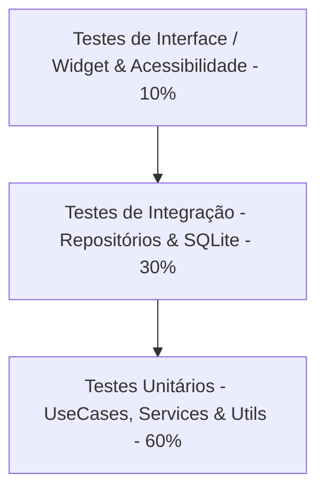

# Plano de Testes Mobile - Sistema de Biblioteca Digital (TDD First)

Este documento estabelece o plano de testes automatizados, estruturado com foco em **TDD First (Test-Driven Development)**, para a aplicação mobile (Flutter) especificada em [especificacoes.md](file:///home/uab/mobile/docs/especificacoes.md).

---

## 1. Visão Geral da Estratégia de Testes

A estratégia de testes adota o desenvolvimento orientado a testes (**TDD**). Nenhum código de produção deve ser escrito antes que um teste correspondente que falhe (Red) tenha sido definido. O objetivo é assegurar o comportamento esperado de cada componente da arquitetura, prevenir regressões durante refatorações e assegurar a conformidade com as regras de negócio críticas, segurança e acessibilidade.

---

## 2. Premissas e Escopo

*   **Escopo**: Cobertura de todas as funcionalidades de domínio (UseCases), serviços transversais, repositórios de dados local (SQLite) e componentes de interface do usuário descritos no documento de especificações.
*   **Isolamento**: Todo e qualquer recurso externo (Rede, Banco de Dados, Sensores) deve ser simulado por meio de Mocks ou Fakes.
*   **Acessibilidade**: Validação sistemática de propriedades de acessibilidade (Semântica, Rótulos, Contraste e Tamanho de Toque) em todos os fluxos visuais.

---

## 3. Pirâmide de Testes Adotada



1.  **Testes Unitários (60%)**: Validação rápida e isolada da lógica de negócios (`UseCases`), entidades de domínio (`Entities`), serviços internos (`Services`) e funções utilitárias (`Utils`).
2.  **Testes de Integração (30%)**: Validação da integração dos `Repositories`, `Datasources` e da persistência física no banco `SQLite` local em memória.
3.  **Testes de Widget/Interface (10%)**: Validação de árvore de widgets, navegação entre telas, comportamento responsivo de layouts e acessibilidade de componentes visuais.

---

## 4. Mapeamento das Funcionalidades para os Testes

| Módulo / Funcionalidade | Arquivo Associado | Testes Mapeados (IDs) |
| :--- | :--- | :--- |
| **Inicialização e Configuração** | `app.dart`, `main.dart`, `routes/`, `theme/`, `config/` | T-UNIT-CFG-001, T-WID-UI-001 |
| **Persistência SQLite** | `DatabaseService.dart` | T-INT-DB-001, T-INT-DB-002 |
| **Carga de Dados Iniciais** | `SeedService.dart` | T-UNIT-SEED-001 |
| **Autenticação e Sessão** | `AuthService.dart` | T-UNIT-AUTH-001, T-UNIT-AUTH-002, T-UNIT-AUTH-003 |
| **Gestão de Solicitações** | `EnviarSolicitacaoUseCase.dart`, `ResponderSolicitacaoUseCase.dart` | T-UNIT-REQ-001, T-UNIT-REQ-002, T-UNIT-REQ-003, T-UNIT-REQ-004 |
| **Gestão de Usuários** | `CadastrarUsuarioUseCase.dart`, `CadastrarEditorUseCase.dart`, `AtualizarUsuarioUseCase.dart`, `InativarUsuarioUseCase.dart` | T-UNIT-USR-001, T-UNIT-USR-002, T-UNIT-USR-003, T-UNIT-USR-004 |
| **Gestão de Livros** | `CadastrarLivroUseCase.dart`, `AtualizarLivroUseCase.dart`, `InativarLivroUseCase.dart` | T-UNIT-BOK-001, T-UNIT-BOK-002, T-UNIT-BOK-003 |
| **Operações de Empréstimo** | `RegistrarEmprestimoUseCase.dart`, `RegistrarDevolucaoUseCase.dart`, `RenovarEmprestimoUseCase.dart` | T-UNIT-LON-001, T-UNIT-LON-002, T-UNIT-LON-003, T-UNIT-LON-004 |
| **Relatórios e Painel** | `GerarRelatoriosUseCase.dart` | T-UNIT-REP-001 |
| **Navegação e Interface** | `NavigationService.dart`, `AccessibilityService.dart`, `/lib/features/` | T-WID-UI-002, T-WID-UI-003, T-WID-UI-004, T-WID-UI-005, T-WID-UI-006, T-WID-UI-007 |

---

## 5. Matriz de Casos de Teste

### 5.1 Testes Unitários (Camada de Domínio e Serviços)

#### T-UNIT-CFG-001: Validação de Configurações Globais
*   **Funcionalidade associada**: Configuração de Inicialização (`/lib/app/config/`)
*   **Objetivo**: Validar a leitura e obrigatoriedade de variáveis de ambiente no arquivo `.env`.
*   **Pré-condições**: Arquivo `.env` configurado.
*   **Entrada**: Variáveis de configuração carregadas.
*   **Passos**:
    1. Instanciar a classe de configuração.
    2. Tentar carregar valores obrigatórios (Ex: `API_URL`).
*   **Resultado esperado**: Configurações carregadas com sucesso; lança erro estruturado se houver campo obrigatório ausente.
*   **Tipo de teste**: Unitário
*   **Dependências mockadas**: Nenhuma
*   **Prioridade**: Média

#### T-UNIT-SEED-001: Carga de Administrador Padrão
*   **Funcionalidade associada**: Inicialização de Dados (`SeedService.dart`)
*   **Objetivo**: Garantir que o administrador inicial seja gerado no primeiro acesso se não houver registros.
*   **Pré-condições**: Banco de dados limpo e sem usuários.
*   **Entrada**: Chamada da inicialização de seed.
*   **Passos**:
    1. Chamar `SeedService.inicializar()`.
    2. Verificar se o repositório registrou o usuário administrador com perfil `ADMIN_INICIAL`.
*   **Resultado esperado**: Administrador inicial criado com sucesso e marcado para primeiro acesso obrigatório.
*   **Tipo de teste**: Unitário
*   **Dependências mockadas**: `UsuarioRepository`
*   **Prioridade**: Alta

#### T-UNIT-AUTH-001: Autenticação com Sucesso
*   **Funcionalidade associada**: Autenticação (`AuthService.dart`)
*   **Objetivo**: Validar se um usuário válido consegue logar com sucesso.
*   **Pré-condições**: Usuário cadastrado previamente.
*   **Entrada**: Email: `leitor@empresa.com`, Senha: `senhaValida1`.
*   **Passos**:
    1. Invocar `AuthService.login(email, senha)`.
    2. Validar o retorno da sessão de usuário.
*   **Resultado esperado**: Sessão criada contendo ID, Nome e Perfil correto do usuário.
*   **Tipo de teste**: Unitário
*   **Dependências mockadas**: `UsuarioRepository`
*   **Prioridade**: Alta (Crítico)

#### T-UNIT-AUTH-002: Autenticação com Credenciais Inválidas
*   **Funcionalidade associada**: Autenticação (`AuthService.dart`)
*   **Objetivo**: Validar a rejeição de login com credenciais incorretas.
*   **Pré-condições**: Usuário cadastrado previamente.
*   **Entrada**: Email: `leitor@empresa.com`, Senha: `senhaIncorreta`.
*   **Passos**:
    1. Invocar `AuthService.login(email, senha)`.
*   **Resultado esperado**: Lança `AuthException` do tipo `Credenciais inválidas`.
*   **Tipo de teste**: Unitário
*   **Dependências mockadas**: `UsuarioRepository`
*   **Prioridade**: Alta (Crítico)

#### T-UNIT-AUTH-003: Bloqueio de Login por Rate Limiting
*   **Funcionalidade associada**: Segurança de Login (`AuthService.dart`)
*   **Objetivo**: Impedir tentativas consecutivas de ataque de força bruta.
*   **Pré-condições**: Nenhuma.
*   **Entrada**: Executar 5 requisições de login falhas consecutivas dentro do mesmo minuto.
*   **Passos**:
    1. Chamar `AuthService.login` com falhas sucessivas.
    2. Chamar a 6ª tentativa.
*   **Resultado esperado**: A 6ª tentativa lança `RateLimitException` informando o tempo de bloqueio.
*   **Tipo de teste**: Unitário
*   **Dependências mockadas**: `UsuarioRepository`
*   **Prioridade**: Alta

#### T-UNIT-REQ-001: Envio de Solicitação Válida
*   **Funcionalidade associada**: Solicitações (`EnviarSolicitacaoUseCase.dart`)
*   **Objetivo**: Registrar uma nova solicitação enviada por leitor autenticado.
*   **Pré-condições**: Leitor autenticado na sessão ativa.
*   **Entrada**: Assunto: "Acessibilidade", Descrição: "Precisamos de leitores de tela na seção infantil", Prioridade: "ALTA".
*   **Passos**:
    1. Executar `EnviarSolicitacaoUseCase.execute(...)`.
*   **Resultado esperado**: Retorna número de protocolo único gerado e grava no repositório com status inicial `ABERTA`.
*   **Tipo de teste**: Unitário
*   **Dependências mockadas**: `SolicitacaoRepository`, `AuthService`
*   **Prioridade**: Alta

#### T-UNIT-REQ-002: Envio de Solicitação - Falha por Autenticação
*   **Funcionalidade associada**: Solicitações (`EnviarSolicitacaoUseCase.dart`)
*   **Objetivo**: Impedir o envio de solicitações por leitores não autenticados.
*   **Pré-condições**: Sessão inativa ou nula.
*   **Entrada**: Dados de solicitação válidos.
*   **Passos**:
    1. Garantir que `AuthService.getUsuarioIdAutenticado()` retorne nulo.
    2. Chamar `EnviarSolicitacaoUseCase.execute(...)`.
*   **Resultado esperado**: Lança `AuthenticationRequiredException` impedindo a operação.
*   **Tipo de teste**: Unitário
*   **Dependências mockadas**: `SolicitacaoRepository`, `AuthService`
*   **Prioridade**: Alta

#### T-UNIT-REQ-003: Responder Solicitação Válida
*   **Funcionalidade associada**: Atendimento (`ResponderSolicitacaoUseCase.dart`)
*   **Objetivo**: Registrar a resposta de um editor/administrador a uma solicitação aberta.
*   **Pré-condições**: Solicitação com status `ABERTA` cadastrada. Usuário autenticado como `ADMIN` ou `EDITOR`.
*   **Entrada**: ID Solicitação: `123`, Resposta: "Solicitação aceita. Adicionamos áudio livros no acervo.", Status: `RESPONDIDA`.
*   **Passos**:
    1. Invocar `ResponderSolicitacaoUseCase.execute(...)`.
*   **Resultado esperado**: Solicitação atualizada no repositório com a resposta, data atual e autor do atendimento.
*   **Tipo de teste**: Unitário
*   **Dependências mockadas**: `SolicitacaoRepository`, `AuthService`
*   **Prioridade**: Alta

#### T-UNIT-REQ-004: Responder Solicitação - Sem Permissão
*   **Funcionalidade associada**: Atendimento (`ResponderSolicitacaoUseCase.dart`)
*   **Objetivo**: Impedir que usuários com perfil `LEITOR` respondam solicitações.
*   **Pré-condições**: Solicitação `ABERTA` cadastrada. Usuário autenticado como `LEITOR`.
*   **Entrada**: ID Solicitação: `123`, Resposta: "Tentativa de resposta".
*   **Passos**:
    1. Autenticar usuário com papel `LEITOR`.
    2. Invocar `ResponderSolicitacaoUseCase.execute(...)`.
*   **Resultado esperado**: Lança `UnauthorizedException` sem persistir nenhuma alteração.
*   **Tipo de teste**: Unitário
*   **Dependências mockadas**: `SolicitacaoRepository`, `AuthService`
*   **Prioridade**: Alta (Crítico)

#### T-UNIT-USR-001: Cadastro de Editor por Administrador
*   **Funcionalidade associada**: Cadastro de Usuários (`CadastrarEditorUseCase.dart`)
*   **Objetivo**: Permitir a criação de perfil do tipo `EDITOR` por um `ADMIN`.
*   **Pré-condições**: Administrador autenticado.
*   **Entrada**: Nome: "Maria Editora", Email: "maria@empresa.com", Papel: `EDITOR`.
*   **Passos**:
    1. Invocar `CadastrarEditorUseCase.execute(...)`.
*   **Resultado esperado**: Retorna o ID do novo usuário criado.
*   **Tipo de teste**: Unitário
*   **Dependências mockadas**: `UsuarioRepository`, `AuthService`
*   **Prioridade**: Média

#### T-UNIT-USR-002: Auto-cadastro de Leitor - Validação de Senha Forte
*   **Funcionalidade associada**: Cadastro de Usuários (`CadastrarUsuarioUseCase.dart`)
*   **Objetivo**: Impedir criação de senhas que não atendam aos requisitos mínimos de segurança.
*   **Pré-condições**: Nenhuma.
*   **Entrada**: Senha fraca (Ex: `12345`).
*   **Passos**:
    1. Invocar `CadastrarUsuarioUseCase.execute(nome, email, senhaFraca, papel: LEITOR)`.
*   **Resultado esperado**: Lança `WeakPasswordException` informando a necessidade de mínimo 8 caracteres, uma letra e um número.
*   **Tipo de teste**: Unitário
*   **Dependências mockadas**: `UsuarioRepository`
*   **Prioridade**: Alta

#### T-UNIT-USR-003: Auto-cadastro de Leitor - E-mail Duplicado
*   **Funcionalidade associada**: Cadastro de Usuários (`CadastrarUsuarioUseCase.dart`)
*   **Objetivo**: Evitar cadastros duplicados com o mesmo endereço de e-mail.
*   **Pré-condições**: E-mail `existente@empresa.com` previamente cadastrado.
*   **Entrada**: E-mail: `existente@empresa.com`, Senha forte.
*   **Passos**:
    1. Simular no mock do repositório a existência do e-mail.
    2. Invocar `CadastrarUsuarioUseCase.execute(...)`.
*   **Resultado esperado**: Lança `UserConflictException` e não salva dados duplicados.
*   **Tipo de teste**: Unitário
*   **Dependências mockadas**: `UsuarioRepository`
*   **Prioridade**: Alta

#### T-UNIT-USR-004: Atualização Cadastral Autorizada
*   **Funcionalidade associada**: Alteração de Usuários (`AtualizarUsuarioUseCase.dart`)
*   **Objetivo**: Permitir a um usuário atualizar seus próprios dados de cadastro.
*   **Pré-condições**: Usuário autenticado.
*   **Entrada**: ID Usuário: `1`, Novo Nome: "João Alterado".
*   **Passos**:
    1. Invocar `AtualizarUsuarioUseCase.execute(id: 1, nome: "João Alterado")`.
*   **Resultado esperado**: Persiste novos dados com sucesso.
*   **Tipo de teste**: Unitário
*   **Dependências mockadas**: `UsuarioRepository`, `AuthService`
*   **Prioridade**: Média

#### T-UNIT-USR-005: Inativação Lógica de Usuário
*   **Funcionalidade associada**: Exclusão de Usuários (`InativarUsuarioUseCase.dart`)
*   **Objetivo**: Realizar a inativação sem exclusão física do registro no banco para fins de auditoria.
*   **Pré-condições**: Usuário existe no banco. Administrador autenticado.
*   **Entrada**: ID do Usuário a inativar: `456`.
*   **Passos**:
    1. Invocar `InativarUsuarioUseCase.execute(usuarioId: 456)`.
*   **Resultado esperado**: Status do usuário é alterado para `INATIVO` e histórico é preservado.
*   **Tipo de teste**: Unitário
*   **Dependências mockadas**: `UsuarioRepository`, `AuthService`
*   **Prioridade**: Alta

#### T-UNIT-BOK-001: Cadastro de Livro Válido
*   **Funcionalidade associada**: Cadastro de Livros (`CadastrarLivroUseCase.dart`)
*   **Objetivo**: Validar a criação correta de um livro no catálogo.
*   **Pré-condições**: Editor ou Administrador autenticado.
*   **Entrada**: Título: "Livro Teste", Autor: "Autor Teste", Categoria: "Ficção".
*   **Passos**:
    1. Invocar `CadastrarLivroUseCase.execute(...)`.
*   **Resultado esperado**: Livro é criado com status inicial `DISPONIVEL` no repositório.
*   **Tipo de teste**: Unitário
*   **Dependências mockadas**: `LivroRepository`, `AuthService`
*   **Prioridade**: Alta

#### T-UNIT-BOK-002: Cadastro de Livro - Dados Inválidos
*   **Funcionalidade associada**: Cadastro de Livros (`CadastrarLivroUseCase.dart`)
*   **Objetivo**: Validar a obrigatoriedade de campos mínimos.
*   **Pré-condições**: Editor ou Administrador autenticado.
*   **Entrada**: Título: "", Autor: "", Categoria: "".
*   **Passos**:
    1. Invocar `CadastrarLivroUseCase.execute(titulo: "", autor: "", categoria: "")`.
*   **Resultado esperado**: Lança `ValidationException` informando os campos obrigatórios em falta.
*   **Tipo de teste**: Unitário
*   **Dependências mockadas**: `LivroRepository`, `AuthService`
*   **Prioridade**: Alta

#### T-UNIT-BOK-003: Atualização de Dados de Livro
*   **Funcionalidade associada**: Edição de Livros (`AtualizarLivroUseCase.dart`)
*   **Objetivo**: Permitir alteração de dados de livro cadastrado.
*   **Pré-condições**: Livro cadastrado. Editor/Admin autenticado.
*   **Entrada**: ID Livro: `1`, Novo Título: "1984 - Edição Especial".
*   **Passos**:
    1. Invocar `AtualizarLivroUseCase.execute(livroId: 1, titulo: "1984 - Edição Especial")`.
*   **Resultado esperado**: Dados atualizados com sucesso no repositório.
*   **Tipo de teste**: Unitário
*   **Dependências mockadas**: `LivroRepository`, `AuthService`
*   **Prioridade**: Média

#### T-UNIT-BOK-004: Inativação de Livro com Sucesso
*   **Funcionalidade associada**: Remoção de Livros (`InativarLivroUseCase.dart`)
*   **Objetivo**: Inativar livro disponível do catálogo preservando histórico.
*   **Pré-condições**: Livro cadastrado com status `DISPONIVEL`. Editor/Admin autenticado.
*   **Entrada**: ID Livro: `1`.
*   **Passos**:
    1. Invocar `InativarLivroUseCase.execute(livroId: 1)`.
*   **Resultado esperado**: Status do livro é atualizado para `INATIVO` sem exclusão física.
*   **Tipo de teste**: Unitário
*   **Dependências mockadas**: `LivroRepository`, `EmprestimoRepository`, `AuthService`
*   **Prioridade**: Alta

#### T-UNIT-BOK-005: Inativação Impedida de Livro Emprestado
*   **Funcionalidade associada**: Remoção de Livros (`InativarLivroUseCase.dart`)
*   **Objetivo**: Impedir a inativação caso o exemplar esteja com leitor (ativo).
*   **Pré-condições**: Livro com status `EMPRESTADO`. Editor/Admin autenticado.
*   **Entrada**: ID Livro: `1`.
*   **Passos**:
    1. Invocar `InativarLivroUseCase.execute(livroId: 1)`.
*   **Resultado esperado**: Lança `BookLockedException` impedindo a inativação do livro.
*   **Tipo de teste**: Unitário
*   **Dependências mockadas**: `LivroRepository`, `EmprestimoRepository`, `AuthService`
*   **Prioridade**: Alta (Crítico)

#### T-UNIT-LON-001: Solicitação de Empréstimo Válido
*   **Funcionalidade associada**: Empréstimos (`RegistrarEmprestimoUseCase.dart`)
*   **Objetivo**: Registrar uma locação com status inicial para leitor ativo.
*   **Pré-condições**: Livro com status `DISPONIVEL`. Leitor ativo e sem pendências financeiras/atrasos.
*   **Entrada**: ID Livro: `1`, ID Leitor: `2`.
*   **Passos**:
    1. Invocar `RegistrarEmprestimoUseCase.execute(livroId: 1, leitorId: 2)`.
*   **Resultado esperado**: Cria empréstimo com status `ATIVO` (ou `SOLICITADO` conforme fluxo) e status do livro atualizado para `EMPRESTADO`.
*   **Tipo de teste**: Unitário
*   **Dependências mockadas**: `LivroRepository`, `EmprestimoRepository`
*   **Prioridade**: Alta (Crítico)

#### T-UNIT-LON-002: Empréstimo Impedido por Indisponibilidade
*   **Funcionalidade associada**: Empréstimos (`RegistrarEmprestimoUseCase.dart`)
*   **Objetivo**: Evitar alocação dupla de livro indisponível.
*   **Pré-condições**: Livro com status `EMPRESTADO`.
*   **Entrada**: ID Livro: `1`, ID Leitor: `2`.
*   **Passos**:
    1. Invocar `RegistrarEmprestimoUseCase.execute(livroId: 1, leitorId: 2)`.
*   **Resultado esperado**: Lança `BookUnavailableException` sem alterar o status do livro ou criar empréstimos.
*   **Tipo de teste**: Unitário
*   **Dependências mockadas**: `LivroRepository`, `EmprestimoRepository`
*   **Prioridade**: Alta (Crítico)

#### T-UNIT-LON-003: Registrar Devolução de Empréstimo Ativo
*   **Funcionalidade associada**: Empréstimos (`RegistrarDevolucaoUseCase.dart`)
*   **Objetivo**: Validar o fluxo de encerramento do empréstimo de livro.
*   **Pré-condições**: Empréstimo existente e ativo.
*   **Entrada**: ID Empréstimo: `10`.
*   **Passos**:
    1. Invocar `RegistrarDevolucaoUseCase.execute(emprestimoId: 10)`.
*   **Resultado esperado**: Define a data de devolução atual no registro de empréstimo e altera status do livro correspondente para `DISPONIVEL`.
*   **Tipo de teste**: Unitário
*   **Dependências mockadas**: `LivroRepository`, `EmprestimoRepository`
*   **Prioridade**: Alta (Crítico)

#### T-UNIT-LON-004: Renovação de Empréstimo Válido
*   **Funcionalidade associada**: Empréstimos (`RenovarEmprestimoUseCase.dart`)
*   **Objetivo**: Estender prazo de devolução de empréstimo ativo.
*   **Pré-condições**: Empréstimo ativo, sem atrasos e sem reservas de outros leitores.
*   **Entrada**: ID Empréstimo: `10`.
*   **Passos**:
    1. Invocar `RenovarEmprestimoUseCase.execute(emprestimoId: 10)`.
*   **Resultado esperado**: Atualiza a nova data prevista de devolução estendendo o prazo padrão (ex. 7 dias).
*   **Tipo de teste**: Unitário
*   **Dependências mockadas**: `EmprestimoRepository`, `SolicitacaoRepository`
*   **Prioridade**: Alta

#### T-UNIT-REP-001: Geração de Relatório Consolidado
*   **Funcionalidade associada**: Relatórios (`GerarRelatoriosUseCase.dart`)
*   **Objetivo**: Validar a sumarização de dados administrativos.
*   **Pré-condições**: Administrador autenticado.
*   **Entrada**: Filtro de data de início e fim.
*   **Passos**:
    1. Invocar `GerarRelatoriosUseCase.execute(dataInicio, dataFim)`.
*   **Resultado esperado**: Retorna lista agregada contendo número total de empréstimos, livros mais lidos e leitores ativos.
*   **Tipo de teste**: Unitário
*   **Dependências mockadas**: `EmprestimoRepository`, `AuthService`
*   **Prioridade**: Baixa

---

### 5.2 Testes de Integração (Camada de Dados e Infraestrutura)

#### T-INT-DB-001: Inicialização do Esquema SQLite
*   **Funcionalidade associada**: Banco de Dados Local (`DatabaseService.dart`)
*   **Objetivo**: Garantir a criação das tabelas e índices corretos na inicialização.
*   **Pré-condições**: Banco de dados não inicializado.
*   **Entrada**: Abertura de conexão SQLite.
*   **Passos**:
    1. Instanciar e inicializar `DatabaseService` utilizando conexão em memória (`:memory:`).
    2. Consultar tabelas de sistema (`sqlite_master`) para validar se tabelas `Usuarios`, `Livros` e `Emprestimos` existem.
*   **Resultado esperado**: Tabelas estruturadas e índices de performance gerados corretamente.
*   **Tipo de teste**: Integração
*   **Dependências mockadas**: Nenhuma (Usa SQLite real em memória)
*   **Prioridade**: Alta (Crítico)

#### T-INT-DB-002: Persistência Física e Rollback em Transações
*   **Funcionalidade associada**: Transações de Dados (`DatabaseService.dart` e `EmprestimoRepository`)
*   **Objetivo**: Assegurar que uma transação de empréstimo (criação de registro + alteração de status do livro) execute de forma atômica.
*   **Pré-condições**: Conexão com banco local em memória ativa.
*   **Entrada**: Tentativa de registrar empréstimo que falha na segunda etapa.
*   **Passos**:
    1. Iniciar transação.
    2. Registrar inserção de empréstimo.
    3. Forçar erro ao atualizar status do livro (simulando falha de escrita).
    4. Verificar se a inserção do empréstimo foi revertida (rollback).
*   **Resultado esperado**: O banco não mantém o registro de empréstimo criado (estado anterior preservado).
*   **Tipo de teste**: Integração
*   **Dependências mockadas**: Nenhuma
*   **Prioridade**: Alta

---

### 5.3 Testes de Widget/Interface (Camada de Apresentação e Acessibilidade)

#### T-WID-UI-001: Acessibilidade e Semântica do Formulário de Login
*   **Funcionalidade associada**: Login UI (`/lib/features/auth/`)
*   **Objetivo**: Validar a compatibilidade da tela de login com leitores de tela e contraste acessível.
*   **Pré-condições**: Inicialização do widget de Login.
*   **Entrada**: Renderização da tela inicial.
*   **Passos**:
    1. Renderizar o widget de login.
    2. Executar a verificação do nó semântico (`find.bySemanticsLabel`).
    3. Verificar se campos de email e senha possuem rótulos descritivos associados.
    4. Verificar se botões possuem altura de toque de pelo menos 48 pixels.
*   **Resultado esperado**: Atende aos padrões WCAG, com rótulos corretos e área mínima de clique respeitada.
*   **Tipo de teste**: Widget / Acessibilidade
*   **Dependências mockadas**: `AuthService`
*   **Prioridade**: Alta

#### T-WID-UI-002: Busca Dinâmica em Tempo Real no Catálogo
*   **Funcionalidade associada**: Catálogo UI (`/lib/features/catalogo/`)
*   **Objetivo**: Garantir que digitar no campo de busca filtre a listagem instantaneamente sem recarregar a tela.
*   **Pré-condições**: Catálogo inicializado com livros fictícios.
*   **Entrada**: Entrada de texto: "1984".
*   **Passos**:
    1. Renderizar a tela de catálogo.
    2. Digitar "1984" no campo de busca.
    3. Aguardar a atualização do widget de lista.
*   **Resultado esperado**: Apenas o livro "1984" é visível na tela; livros de outros títulos desaparecem.
*   **Tipo de teste**: Widget
*   **Dependências mockadas**: `LivroRepository`
*   **Prioridade**: Média

#### T-WID-UI-003: Renderização Responsiva por Perfil de Usuário
*   **Funcionalidade associada**: Dashboard UI (`/lib/features/dashboard/`)
*   **Objetivo**: Exibir painéis e menus contextuais dinamicamente com base nas permissões de usuário.
*   **Pré-condições**: Autenticação active.
*   **Entrada**: Usuário autenticado como `LEITOR`.
*   **Passos**:
    1. Renderizar tela principal do Dashboard.
    2. Verificar presença dos botões e painéis de administração (Ex: "Cadastrar Livro").
*   **Resultado esperado**: Elementos administrativos ocultados ou não renderizados para perfil `LEITOR`.
*   **Tipo de teste**: Widget
*   **Dependências mockadas**: `AuthService`
*   **Prioridade**: Alta

#### T-WID-UI-004: Contraste de Badges e Legibilidade de Status
*   **Funcionalidade associada**: Listagem de Empréstimos UI (`/lib/features/emprestimos/`)
*   **Objetivo**: Verificar se os badges de status de empréstimo utilizam cores contrastantes de acordo com o padrão visual estabelecido.
*   **Pré-condições**: Empréstimo com status `ATIVO` renderizado na listagem.
*   **Entrada**: Renderização da tela "Meus Empréstimos".
*   **Passos**:
    1. Localizar o badge de status do empréstimo ativo.
    2. Verificar as cores de fundo (background) e de primeiro plano (texto) aplicadas ao widget.
*   **Resultado esperado**: Cores e contrastes em conformidade com as diretrizes do tema visual para alta legibilidade.
*   **Tipo de teste**: Widget / Acessibilidade
*   **Dependências mockadas**: `EmprestimoRepository`
*   **Prioridade**: Média

#### T-WID-UI-005: Formatação Regional de Datas de Empréstimos
*   **Funcionalidade associada**: Empréstimos UI (`/lib/features/emprestimos/`)
*   **Objetivo**: Validar a exibição da data no formato padrão `DD/MM/AAAA HH:MM`.
*   **Pré-condições**: Registro de empréstimo com data ISO registrada.
*   **Entrada**: Data ISO: `2026-06-22T17:00:00`.
*   **Passos**:
    1. Renderizar a tela de histórico de empréstimo contendo o registro.
    2. Validar o texto exibido no componente de data.
*   **Resultado esperado**: O texto renderizado deve corresponder a `"22/06/2026 17:00"`.
*   **Tipo de teste**: Widget
*   **Dependências mockadas**: `EmprestimoRepository`
*   **Prioridade**: Baixa

#### T-WID-UI-006: Feedback e Exibição de Mensagens Flash
*   **Funcionalidade associada**: Notificações UI (`/lib/features/auth/`)
*   **Objetivo**: Validar a exibição e desaparecimento automático de alertas visuais (Snackbars).
*   **Pré-condições**: Renderização de tela ativa.
*   **Entrada**: Ação que dispara erro (Ex: Cadastro com dados em branco).
*   **Passos**:
    1. Clicar no botão cadastrar com campos vazios.
    2. Verificar a aparição de um alerta visual (Snackbar/Flash Message) contendo a mensagem de validação correspondente.
*   **Resultado esperado**: Mensagem de erro renderizada imediatamente no topo ou rodapé da tela.
*   **Tipo de teste**: Widget
*   **Dependências mockadas**: Nenhuma
*   **Prioridade**: Média

#### T-WID-UI-007: Navegação por Teclado e Leitor de Tela no Menu Superior
*   **Funcionalidade associada**: Navegação UI (`/lib/app/routes/` e `/lib/features/`)
*   **Objetivo**: Assegurar a correta ordem de foco dos elementos de menu estruturado.
*   **Pré-condições**: Usuário logado como administrador.
*   **Entrada**: Exibição da barra superior (Navbar).
*   **Passos**:
    1. Renderizar a visualização com menu aninhado de admin.
    2. Simular comandos sequenciais de navegação por foco (Tab/D-Pad).
    3. Validar se a ordem do foco acompanha o fluxo visual coerente.
*   **Resultado esperado**: Foco navega ordenadamente através dos itens de menu sem pular elementos ou ficar travado em loops.
*   **Tipo de teste**: Widget / Acessibilidade
*   **Dependências mockadas**: `AuthService`
*   **Prioridade**: Alta

---

## 6. Estratégia de Automação e Prevenção de Regressões

A fim de prevenir bugs e regressões funcionais nas próximas sprints, o projeto utilizará uma estratégia de execução de pipeline em duas frentes:

1.  **Validação em Commit (Pré-Push Hooks - Local)**:
    Uso de hooks Git locais que executam testes rápidos antes de aceitar alterações locais:
    ```bash
    flutter analyze
    flutter test
    ```
2.  **Integração Contínua (CI/CD)**:
    Configuração de um fluxo integrado (Ex: GitHub Actions, GitLab CI) rodando testes unitários, testes de widget e validação de formatação e análise estática em todas as solicitações de merge/pull requests.

---

## 7. Dependências Recomendadas para Testes

As seguintes bibliotecas e pacotes devem ser configurados no [pubspec.yaml](file:///home/uab/mobile/pubspec.yaml) sob o nó `dev_dependencies` para viabilizar as estratégias propostas:

```yaml
dev_dependencies:
  flutter_test:
    sdk: flutter
  integration_test:
    sdk: flutter
  mocktail: ^1.0.3       # Framework moderno de mocking com suporte total a null-safety
  sqflite_common_ffi: ^2.3.0 # FFI para suporte de testes SQLite em ambiente desktop local (testes de integração)
```

---

## 8. Observações sobre Acessibilidade, Responsividade e Manutenção

*   **Padrões WCAG 2.1**: A aplicação deve manter um nível de contraste de no mínimo `4.5:1` para textos normais. A ordem de leitura e foco dos elementos interativos é fundamental, devendo ser validada em testes de widget através do objeto `SemanticsTester`.
*   **Responsividade**: Telas críticas devem ser testadas em resoluções de tela variadas (simulando proporções de tela menores, como 320x480 pixels, e maiores, como tablets) para evitar truncamento de textos e estouros de layout (*overflow warnings*).
*   **Padrão DRY nos Testes**: Utilizar factories de mocks centralizadas para evitar a repetição desnecessária de configurações de dados fictícios em múltiplos arquivos de testes.
